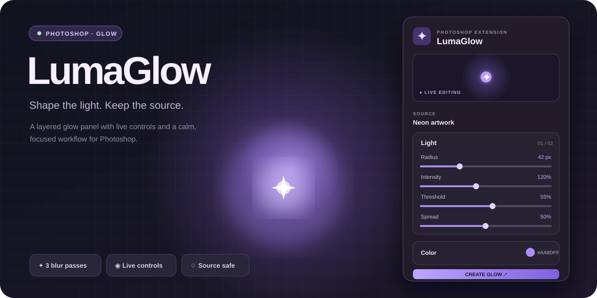

<div align="center">
  

  <h1>LumaGlow</h1>
  <p><strong>Shape the light. Keep the source.</strong></p>
  <p>Layered glow for Photoshop with live, editable controls.</p>
</div>

---

### At a glance

| Light that stays editable | A focused panel | Source layer preserved |
| --- | --- | --- |
| Three native blur passes build a soft core, halo, and atmosphere. | Adjust radius, intensity, threshold, spread, and tint. | The effect lives in its own Screen blend group. |

> **Preview note:** The image above is an illustration of the panel, not a Photoshop screenshot. The CEP extension still needs a live Photoshop smoke test.

## Get started

1. Open an **RGB document** in Photoshop and select a pixel, text, shape, or smart object layer. Convert a Background layer to a normal layer first.
2. Open **Window → Extensions (Legacy) → LumaGlow**.
3. Click **Create glow**. Move a slider or choose a tint; the generated group updates after a short pause.
4. Select the **LumaGlow group** later to restore its controls. Click **Refresh** after changing the source pixels.

```text
Source layer → highlight threshold → core + halo + atmosphere → Screen blend group
```

## Install on Windows

This repository contains an **unsigned development extension**, not a signed `.zxp` installer. The included script copies the extension into your user CEP folder and enables `PlayerDebugMode` for CEP 12 in your user registry. That setting allows unsigned CEP panels to load.

1. Clone or download this repository.
2. Run [`install-windows.ps1`](install-windows.ps1) with PowerShell.
3. Restart Photoshop, then open **Window → Extensions (Legacy) → LumaGlow**.

For a manual install, copy this folder to `%APPDATA%\Adobe\CEP\extensions\`. Set the **String Value** `PlayerDebugMode` to `1` at `HKEY_CURRENT_USER\Software\Adobe\CSXS.12` for Photoshop versions using CEP 12 (25.12 and newer). Photoshop versions using CEP 11 use `CSXS.11` instead. See [Adobe's CEP resources](https://github.com/Adobe-CEP/CEP-Resources) for the development workflow.

On macOS, use `~/Library/Application Support/Adobe/CEP/extensions/` and the matching CSXS debug setting. This repo's install script is Windows only.

## Controls

| Control | What it changes | Range |
| --- | --- | ---: |
| **Radius** | Overall size of the three blur passes | 2–180 px |
| **Intensity** | Strength of the glow layers | 0–300% |
| **Threshold** | Which source highlights contribute to the glow | 0–95% |
| **Spread** | Balance between the tight core and wide atmosphere | 0–100% |
| **Glow tint** | The hue passed to Photoshop's Photo Filter | Six-digit hex |
| **Tint mix** | Strength of the Photo Filter color | 0–100% |

## How it is built

```text
CSXS/manifest.xml       CEP panel registration
client/                 HTML, CSS, and panel controls
host/lumaglow.jsx       Photoshop ExtendScript effect engine
install-windows.ps1     User-level development install
assets/preview.svg      README illustration
```

The JSX host duplicates the source into a generated group, applies Levels and Gaussian Blur at three scales, adds Photo Filter tint, and sets each pass to Screen. It stores control values in the group name so selecting the group restores the panel state.

## Current limits

- Control changes rebuild the generated group. Manual edits inside that group are replaced on the next update.
- The source must be a non-background art layer in an RGB document.
- This is a layered glow approximation, not a pixel-identical port of another product.
- The panel and effect have passed source checks, but host behavior has not yet been verified in Photoshop.

---

<div align="center"><sub>Made for fast glow experiments inside Photoshop.</sub></div>
